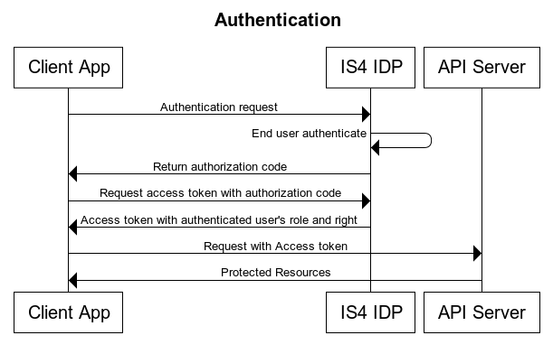
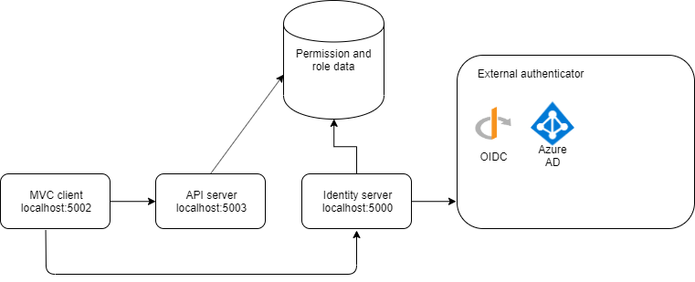

# is4_test

## Quick start 
Ignore project IdentityServerAspNetIdentity

The main project are:

* IdentityServer - the IS4 powered IDP  
    run on localhost:5000
* Api -  the resource api server  
    run on localhost:5003
* MVC -  the client frontend app  
    run on localhost:5002

Run the above project with dotnet run

sample user:
------
username: alice@alice.com
password: 123456
role: Admin

username: bob@bob.com
password: 123456
role: Manager

username: eve@eve.com
password: 123456
role: User

## Architecture

## Scenario

We have 3 Applications:
* A backend server serving API
* A MVC frontend application
* An Identity Provider server using IS4 and inmemory database

Question: How can we config the application so that the backend and frontend app understand the authenticated user's role and permission(right) that is stored and retrieved from the Identity Provider server?

## Implementation

We use OpenIdConnect to facilitate user authenticating between Applications.  
IS4 is used to implement the inner working of the Identity Provider server.  
The backend server use role-based and policy-based authorization to enable permission-based authorization.  
