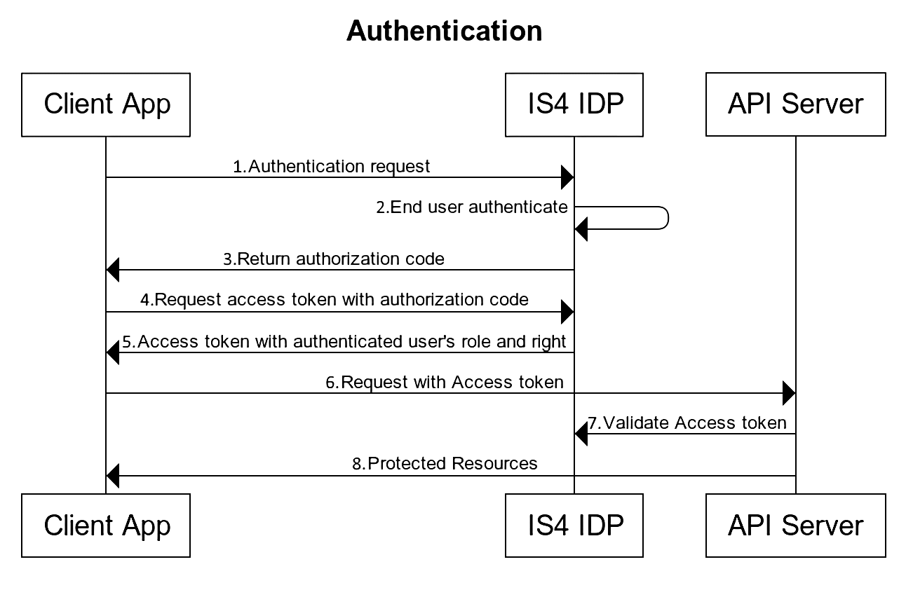
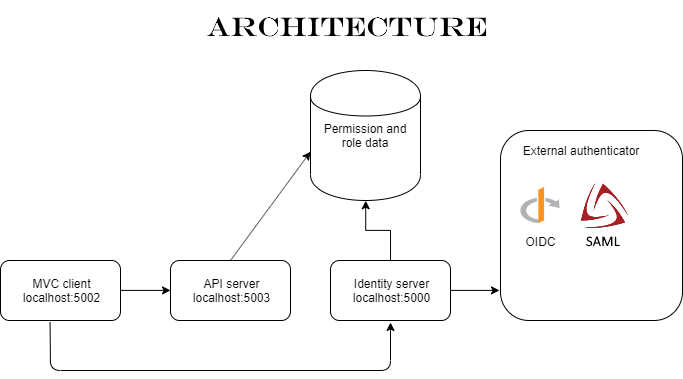

# is4_test

## Quick start 
Ignore project IdentityServerAspNetIdentity

The main project are:

* IdentityServer - the IS4 powered IDP  
    run on localhost:5000
* Api -  the resource api server  
    run on localhost:5003
* MVC -  the client frontend app  
    run on localhost:5002

Run the above project with dotnet run

sample user:
username: alice@alice.com
password: 123456

## Architecture

